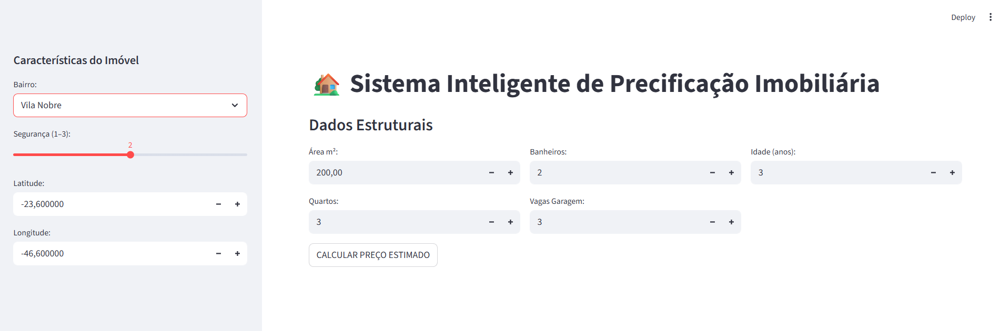

# 🏡 Sistema Inteligente de Precificação Imobiliária

Aplicação web desenvolvida com **Streamlit** e **Machine Learning** para estimar o preço de imóveis residenciais a partir de características estruturais e de localização.

O projeto integra **modelo de rede neural treinado com TensorFlow/Keras**, **pré-processamento com Scikit-learn** e uma **interface visual moderna**, realizado para um trabalho para minha Pós-graduação em Inteligência Artificial e Machine Learning.

---

## 🎯 Objetivo do Projeto

Fornecer uma **estimativa automatizada de valor imobiliário**, auxiliando corretores, estudantes e entusiastas de ciência de dados a compreenderem como modelos de aprendizado de máquina podem apoiar decisões no mercado imobiliário.

---

## 🧠 Modelo de Machine Learning

* Tipo: **Rede Neural Artificial (MLP)**
* Framework: **TensorFlow / Keras**
* Arquitetura:

  * Camada Dense (64 neurônios)
  * Camada Dense (32 neurônios)
  * Camada de saída (1 neurônio – preço)
* Pré-processamento:

  * **StandardScaler** para variáveis numéricas
* Persistência:

  * Modelo salvo em `.keras`
  * Scaler salvo em `.pkl`

---

## 🧾 Variáveis Utilizadas

* Área do imóvel (m²)
* Número de quartos
* Número de banheiros
* Vagas de garagem
* Idade do imóvel (anos)
* Índice de segurança do bairro (1 a 3)
* Latitude
* Longitude
* Bairro (codificado)

---

## 🖥️ Interface do Sistema

A interface foi construída com **Streamlit**, priorizando clareza visual e usabilidade.

### 📌 Funcionalidades:

* Formulário interativo para entrada de dados
* Validações automáticas
* Botão de cálculo do preço estimado
* Exibição clara do resultado
* Layout responsivo e organizado

---

## 📸 Capturas de Tela

### Tela Inicial do Sistema

> Interface principal com formulário de entrada de dados do imóvel





### Resultado da Previsão

> Exibição do preço estimado após o cálculo


---

## 🛠️ Tecnologias Utilizadas

* Python 3.10+
* Streamlit
* TensorFlow / Keras
* Scikit-learn
* Pandas
* NumPy
* Joblib

---

## 📦 Estrutura do Projeto

```text
📁 projeto-precificacao-imobiliaria
│
├── app.py
├── modelo_previsao_imoveis_final.keras
├── scaler.pkl
├── requirements.txt
├── README.md
└── images/
    ├── tela_inicial.png
    └── resultado.png
```

---

## ▶️ Como Executar Localmente

```bash
pip install -r requirements.txt
streamlit run app.py
```

A aplicação estará disponível em:

```
http://localhost:8501
```

---

## 🎓 Contexto Acadêmico

Projeto desenvolvido como parte dos estudos em **Inteligência Artificial e Machine Learning**, com foco prático em:

* Treinamento de modelos supervisionados
* Pipeline de dados
* Deploy de modelos em aplicações web

---

## 👩‍💻 Autora

**Larissa Pelissari**
Designer UX/UI e Desenvolvedora de Software, apaixonada por criar experiências digitais inteligentes e acessíveis.

🔗 LinkedIn: *https://www.linkedin.com/in/laripelissari/*
💻 GitHub: *https://github.com/LariPelissari*

---

## ⭐ Observação Final

Este projeto pode ser expandido com:

* Faixa de confiança de preços
* Visualização em mapa
* Histórico de simulações
* Deploy em nuvem (Streamlit Cloud)

Sinta-se à vontade para evoluí-lo 🚀
